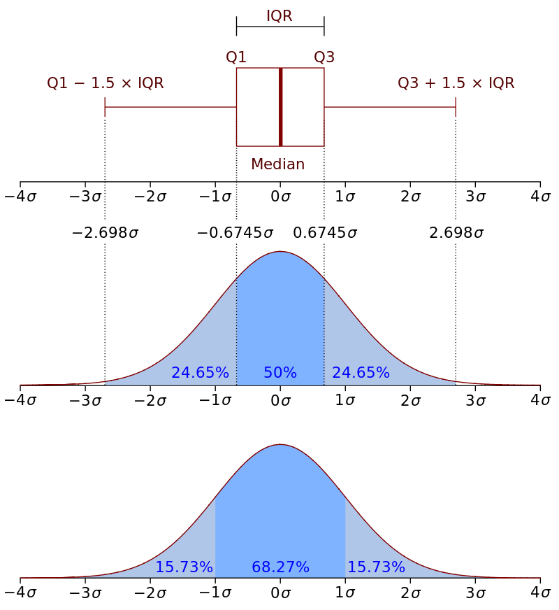

### Components of a ggplot layer
1. data -  a data frame or tibble
2. aesthetic mappings (aes) - specify the variables to be plotted
3. geom  - specify the geometric to be drawn in the layer (e.g. points, lines, bars, etc.)
4. stat - compute and plot statisitcal transforms of the raw date
5. position - adjustments for overlapping elements
6. facet - generate multiple related plots

ggplots are layered compositions of these various components. To add components to the plot we simply add them with a "+"

### Template for ggplot components
```
p1 <- ggplot(data= <DATA>,mapping=aes(<MAPPINGS>) + 
<GEOM_FUNCTION>(aes(<MAPPINGS>),
                stat=<STAT>,
                position=<POSITION>) +
                <COORDINATE_FUNCTION> +
                <FACET_FUNCTION>

print(p1)
ggsave(plot=p1, filename="MyPlot",width=5,height=3,units="in",device="svg")
```

### Packages

```{r}
library(tidyverse)
library(ggplot2) 
library(ggthemes) #extended themes for ggplot
library(patchwork) #tools for composing multiple panels

```

For these examples we will use the `mpg` built in data set from ggplot2

```{r eval=FALSE}
?mpg
```

### Quick plotting for data exploration with `qplot`

```{r}
# simple histogram
qplot(x=mpg$cty) #y-axis is count of observation with a given value of the x
```

We can modify the colors: 

```{r}
qplot(x=mpg$cty,fill=I("goldenrod"),color=I("black")) 
```

Here we used `I()` because if we directly call the color name, R will look for a variable with that name and attempt to apply colors based on the values of the variable. 

```{r}
# simple density plot
qplot(x=mpg$hwy,geom="density")
```

```{r warning=FALSE}
# simple scatter plot with linear regression line
qplot(x=mpg$cty,y=mpg$hwy,geom=c("point","smooth"), method="lm")
```

We can color points by a variable

```{r warning=FALSE}
qplot(x=mpg$cty,y=mpg$hwy, col = mpg$class, geom=c("point"))


# The regression is now applied to each class separately
qplot(x=mpg$cty,y=mpg$hwy, col = mpg$class, geom=c("point","smooth"), method="lm")
```

```{r}
# basic boxplot
qplot(x=mpg$fl, y=mpg$cty,geom="boxplot",fill=I("green")) 
```

Interpretation: 

{width=50%}

```{r}
# simple barplot 
qplot(x=mpg$fl,geom="bar")
```

Most often bar charts are used to display summary values by group. One way to do this is to use `dplyr` to calculate summary stats and plot those with `col`

```{r}
# bar plot with specified means

mpg_summary<-mpg %>%
  group_by(class) %>%
  summarise(mean_hwy = mean(hwy))

p<-qplot(x=mpg_summary$class, y=mpg_summary$mean_hwy, geom="col")

p
```

We can flip this plot by layering `coord_flip`:

```{r}
p + coord_flip()
```


## Full `ggplots`

### Themes and fonts 

```{r}
p1 <- ggplot(data=mpg, mapping=aes(x=hwy,y=cty)) +
  geom_point()
print(p1)
```

Now that we have created the plot object `p1` we can layer elements and themes onto it

```{r}
 p1 + theme_bw() #clean with gridlines
```


```{r}
p1 + theme_classic() # no grid lines
```

```{r}
p1 + theme_dark() # good for brightly colored points
```

```{r}
 p1 + theme_void() # shows data only
```

If you must: 

```{r}
 p1 + theme_excel()
```

### Theme modifications

#### Control font and size of text

```{r}
 # use theme parameters to modify font and font size. 
 p1 + theme_classic(base_size=25,base_family="sans")
```

`base_<XXX>` modifies throughout the figure. You can also control specific elements:

```{r}
p1 + labs(x="Highway Gas Milage (mpg)") + # replace the default label on the y-axis
  theme_classic() +
  theme(axis.title.x = element_text(size = 15, angle = 45, vjust = 0.5)) # specifically change font size, angle, and position of x-axis label
```

#### Minor modifications

```{r}
p1 <- ggplot(data=mpg) +
  aes(x=hwy,y=cty) + 
  geom_point(size=7,
             shape=25,
             color="black",
             fill="hotpink") +
  labs(title="My graph title here",
       subtitle="An extended subtitle that will print below the main title",
       x="My x axis label",
       y="My y axis label") +
  xlim(0,50) +
  ylim(0,50)
      
p1
```


A convenient document with base colors can be found [here](http://www.stat.columbia.edu/~tzheng/files/Rcolor.pdf)

```{r eval=FALSE}
colors() # will return a list of all colors in base R
```

```
Lesson developed with materials adapted from: https://gotellilab.github.io/Bio381/
```